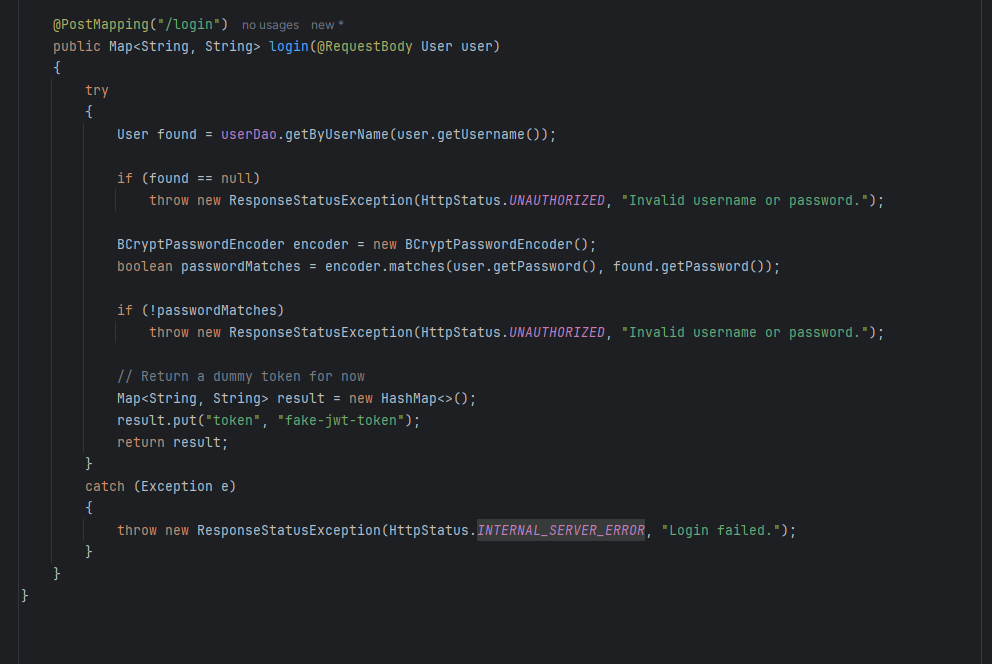

# EasyShop (Capstone Project)

EasyShop is a application developed as a capstone project. It provides product browsing, user registration and login,
and category filtering, with data managed via a MySQL backend.
The backend is written in Java using Spring Boot.

## Features

- Search products by category, price, and color
- Browse category listings (in-memory or MySQL-driven)
- Register new users with persistent database storage
- Login functionality using DAO and SQL
- REST API endpoints for product, category, and user operations
- JDBC implementation with dependency injection
- Configurable MySQL database via Spring Boot
- Tested endpoints with Postman

## Technologies Used

- Java 17
- Spring Boot 3.x
- MySQL 8.x
- Maven
- JDBC with Apache Commons DBCP
- IntelliJ IDEA
- Git & GitHub
- Postman

## Setup Instructions

### Prerequisites

- Java 17 SDK installed
- MySQL Server running locally
- IntelliJ IDEA or another Java IDE
- Git installed
- Postman (optional for API testing)

### 1. Configure MySQL

1. Create the database:
```sql
CREATE DATABASE easyshop;
```

2. Edit `src/main/resources/application.properties`:

```properties
spring.datasource.url=jdbc:mysql://localhost:3306/easyshop
spring.datasource.username=root
spring.datasource.password=P@ssw0rd
```

### 2. Run the Application

Open the project in IntelliJ and run `Main.java`

### 4. Test Endpoints (Optional)

Use Postman to test:

- GET http://localhost:8080/products
- GET http://localhost:8080/categories
- POST http://localhost:8080/users/register
- POST http://localhost:8080/users/login

## Interesting Code Snippets

shows what happens for any errors logging in and it will return a dummy token for a successful login

### Product Search Query with Optional Filters

```java
String sql = "SELECT * FROM products " +
             "WHERE (category_id = ? OR ? = -1) " +
             "AND (price <= ? OR ? = -1) " +
             "AND (color = ? OR ? = '')";
```

This SQL query allows searching products by optional filters: category, price, and color.

### User Registration Logic

```java
public void create(User user) {
    String sql = "INSERT INTO users (username, password) VALUES (?, ?)";
    try (Connection conn = dataSource.getConnection();
         PreparedStatement stmt = conn.prepareStatement(sql)) {
        stmt.setString(1, user.getUsername());
        stmt.setString(2, user.getPassword());
        stmt.executeUpdate();
    } catch (SQLException e) {
        throw new RuntimeException("Error creating user", e);
    }
}
```

Registers a user into the database using prepared statements and JDBC.

## Project Structure

```
com.easyshop
├── Main.java
├── config
│   └── DatabaseConfig.java
├── controllers
│   ├── ProductController.java
│   ├── CategoryController.java
│   └── UserController.java
├── data
│   ├── ProductDao.java
│   ├── CategoryDao.java
│   ├── UserDao.java
│   └── mysql
│       ├── MySqlProductDao.java
│       ├── MySqlCategoryDao.java
│       └── MySqlUserDao.java
├── models
│   ├── Product.java
│   ├── Category.java
│   └── User.java
└── resources
    └── application.properties
```

## Authors and Special Thanks

**Author**  
Timothy Gomez – Raymond Maroun

Built through the YearUp Focus Academy Capstone with a concentration in backend development using Java and SQL.

**Instructor**  
Raymond Maroun – For providing hands-on support, helping resolve technical issues, and guiding us through Spring Boot and database integration.

**Special Thanks**
- Focus Academy staff for creating an engaging and supportive learning environment
- Class peers for collaboration and feedback
- Pluralsight, Stack Overflow, and W3Schools for supplemental reference